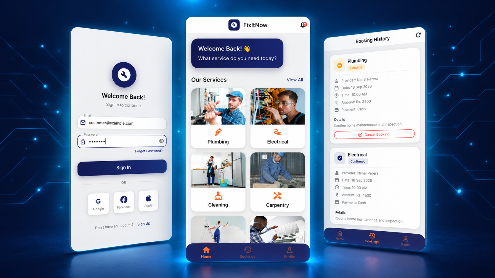

# FixItNow Mobile App

FixItNow is a Flutter-based mobile application for home maintenance and service booking.  
It connects customers with service providers for tasks like plumbing, electrical work, cleaning, carpentry, painting, and AC repair.



## Overview

FixItNow is designed to simplify home service requests with a clean mobile experience.  
The app includes:

- Customer authentication
- Service browsing and booking
- Booking history
- Profile management
- Provider dashboard
- Reviews and ratings
- Local notifications
- Light-themed modern UI built with Flutter

## Features

### Customer Features
- Splash screen and onboarding flow
- Login and registration screens
- Browse and book home services
- Choose service type, date, time slot, and provider
- View booking history
- Submit provider reviews and ratings
- Manage profile details

### Provider Features
- Dedicated provider dashboard
- View service-related activity and updates

### App Experience
- Smooth Flutter UI
- Route-based navigation
- Responsive layout
- State management with Riverpod
- Notification support
- Persistent local storage support

## Tech Stack

- **Framework:** Flutter
- **Language:** Dart
- **State Management:** flutter_riverpod
- **Notifications:** flutter_local_notifications
- **Storage:** shared_preferences
- **Calendar UI:** table_calendar
- **Date Formatting:** intl
- **Icons:** font_awesome_flutter
- **Typography:** google_fonts
- **Ratings UI:** flutter_rating_bar

## Project Structure

```text
lib/
├── main.dart
├── screens/
│   ├── splash_screen.dart
│   ├── auth/
│   │   ├── login_screen.dart
│   │   └── register_screen.dart
│   ├── customer/
│   │   ├── home_screen.dart
│   │   ├── booking_screen.dart
│   │   ├── booking_history_screen.dart
│   │   ├── profile_screen.dart
│   │   └── review_screen.dart
│   └── provider/
│       └── provider_dashboard.dart
├── services/
│   └── notification_service.dart
├── models/
├── providers/
├── utils/
│   └── theme.dart
```
